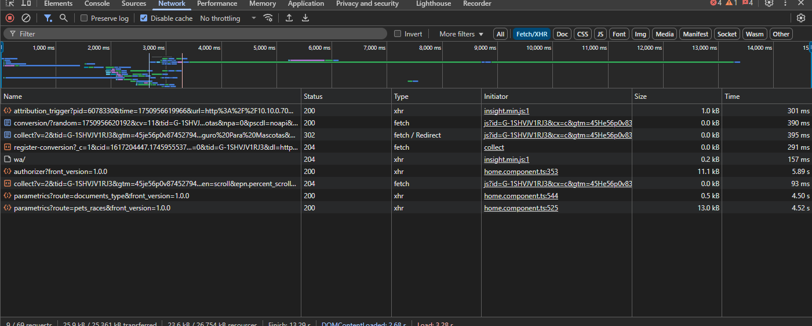
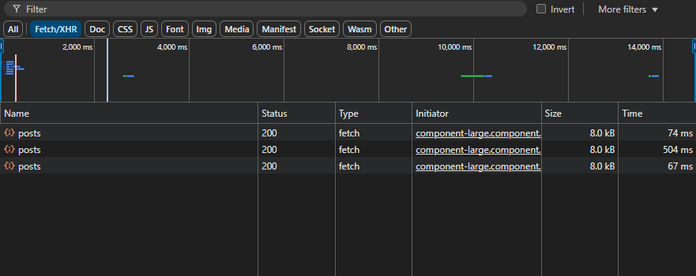
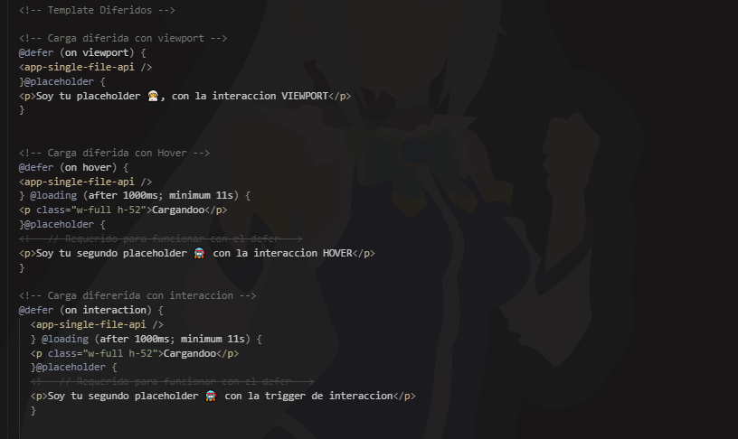

# Optimizacion con las Cargas Diferidas de Angular 17+

## Sin cargas Diferidas

Ejemplo de waterfall de un proyecto real de la empresa

 

## Con cargas Diferidas

Ejemplo waterfall Practico

### **Problema :  Carga no Diferida  ❌**

El problema no es seriamente que las peticiones se ejecuten en el método ngOnInit, sino que la mayoría de estos recursos no están siendo usados sino hasta que el usuario esté haciendo uso del formulario

Si estas páginas están hechas para clientes o usuarios, es obviamente que, dependiendo del dispositivo o la computadora ,tambien es el rendimiento. Ese es uno de los muchos aspectos que nos soluciona esta directiva

### **La Solución: Carga Diferida con `@defer` ✅**

Angular 17+ añadio nuevas directivas como en este caso `@defer`, `@placeholder`, y `@loading` como una solución elegante para este problema. Estas directivas permiten **diferir la carga de recursos de componentes o bloques de contenido** hasta que se cumplan ciertas condiciones o `disparadores` (triggers).

Esto significa que los recursos solo se solicitan y se ejecutan solamente cuando vayan a ser utilizados-

Puedes encontrar más detalles en la [documentación oficial de Angular sobre `@defer`](https://angular.dev/guide/templates/defer).

---

### **Ejemplo de Uso Sencillo de `@defer`**

AQUI puedes ver un ejemplo de como `@defer` distribuye las cargas de recursos basándose en la interacción del usuario o en condiciones específicas. En el primer ejemplo del video, Angular detecta automáticamente cuando un componente entra en la vista del usuario (`on viewport`), se hace hover (`hover`) en el componente o se interactua con el (`interaction`) y solo entonces empieza a cargar y ejecutar sus recursos necesarios.

### **Codigo Ejemplo**

`@defer`: Directiva que se encarga de reducir el tamaño principal de un componente al momento de cargar.

`@placeholder`: Es el bloque opcional que se va a mostrar mientras no se dispara el evento

`@loading`: Es el bloque que se muestra mientras se carga el componente y sus recursos

`@error` : Es cuando se ejecuta algun error en la carga de componente

## Disparadores

[Documentacion oficial de Angular](https://angular.dev/guide/templates/defer)

Con `@defer`, las cargas se distribuyen estrategicamente, asegurando que tu aplicación sea más rapida y eficiente, ofreciendo una mejor experiencia tanto para tus usuarios como para los motores de búsqueda.
